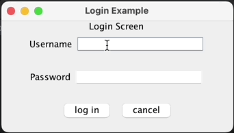

# Clean Architecture Team Lab Activity: Login and Logout

In this team lab activity, your team will:
- explore an existing use case (login)
- add a new use case (logout).

To earn credit:
- your team must demo your working `logout` use case.

Your demo should be similar to the below example:



---

## Task 0: Fork this repo on GitHub
**To get started, one team member should fork this repo on GitHub and share it with the team.
All team members should then clone it.**


**Suggested logistics:** One of you should invite the others to collaborate on their fork of the original repo on GitHub. You can do this in your repo on GitHub under `Settings -> Collaborators`. This will allow you to push branches to a common repo and then use pull requests to contribute your code and review. To prevent others from pushing directly to the main branch, we recommend that you set branch protection rules on GitHub. Below are how the settings might look if you add branch protection rules:


---

## Task 1: Understanding the Program

Open the project in IntelliJ. Open `app.Main` and read it as a team.
- What are the currently implemented Views and Use Cases in the program?
- Which Use Cases are triggered from each View?
- Which version of the DAO is `app.Main` using?

> Observe that the main method makes use of the `app.AppBuilder` class which
is responsible for constructing our CA engine for each use case of the application. To answer the last two questions above, you will need to look inside the details of the `app.AppBuilder` class.

**Make sure that each member of your team can successfully run `app/Main.java`.**
- Ensure that you are each able to create a new user and log in using the username and password.

> Note: you may need to set the Project SDK in the `Project Structure...` menu, and possibly
> also manually link the Maven project if the app won't run when you try to run Main.

### Task 1.1: Exploring the login use case

Let's take a tour of the login use case code:

- In IntelliJ, find the `LoginController` class and open it.

- Set a breakpoint inside its `execute` method.

- Run the program in debug mode.

- On the login page, attempt to log in with an existing account. When you click the button, the breakpoint that you set will be triggered.

- **Step through the code to trace the execution of the login use case.**
  Importantly, pay extra close attention to what the Presenter does to ensure that the LoggedInView gets displayed after the user successfully gets logged into the application.

> Pay attention to the classes involved and the flow of execution. When your team implements the logout use case next, your code will need to have a very similar structure.

To better understand how the view gets updated, your team may find it useful to review the [Extra Advice about the Presenters, Views, and ViewModels](#extra-advice-about-the-presenters-views-and-viewmodels) section at the end of this README.

## Task 2: Implementing the Logout Use Case

Currently, you'll notice that the "Log Out" button in the `LoggedInView` still doesn't actually log you out of the program. Let's fix this.

We have created all the classes for your team, but some of the code is missing. **As a team, your task is to fill in the missing code so that the logout use case is functional.**

> The next part of the readme describes how your team will do this.

Your team will know when you are done when:

- Clicking the "Log Out" button takes the user back to the Login View when you use the program.
- On the Login View, the username of the logged-out user is filled in.
- The provided `LogoutInteractorTest` test passes.

### Task 2.1: Dividing up the work

There are `TODO` comments left in the files.

> Recall that you can use the TODO tool window to conveniently pull up a complete list.

Once all TODOs are complete, the "Log Out" button _should_ work!

**As a team, split up the TODOs (see below) between the members of your team.**

> Optionally, your team can make GitHub Issues and assign them to each team member.

Make sure that each member has at least one TODO that they will be responsible for completing.
If your team prefers to work in pairs, that is fine too.

The TODOs are summarized below (by file) to help your team decide how to split them up:

---

- `Main.java` (tip: look at how other use cases have been added)
    -[ ] TODO: add the logout use case to the app
  
---

- `LoggedInView.java` (tip: refer to the other views for similar code)
    -[ ] TODO: save the logout controller in the instance variable.
    -[ ] TODO: execute the logout use case through the Controller

---

- `LogoutController.java` (tip: refer to the other controllers for similar code)
    -[ ] TODO: Save the interactor in the instance variable.
    -[ ] TODO: run the use case interactor for the logout use case

> Note: there is no input data necessary for this use case.

---

- `LogoutInteractor.java` (tip: refer to `ChangePasswordInteractor.java` for similar code)
    -[ ] TODO: save the DAO and Presenter in the instance variables.
    -[ ] TODO: implement the logic of the Logout Use Case

> Note: there is no input data necessary for this use case.

---

- `LogoutPresenter.java` (tip: refer to `SignupPresenter.java` for similar code)
    -[ ] TODO: assign to the three instance variables.
    -[ ] TODO: have prepareSuccessView update the LoggedInState
    -[ ] TODO: have prepareSuccessView update the LoginState

---

### Task 2.2: Complete your TODOs!
With the work divided up, your team should complete the TODOs through a sequence of PRs.

1. Make a branch for your work.

> Make sure that you switch to your new branch!

2. Complete your assigned TODO and make a pull request on GitHub. In your pull request,
   briefly describe what your TODO was and how you implemented it. If you aren't sure
   about part of it, include this in your pull request so that everyone knows what to look
   for when reviewing — or you can of course discuss with your team before making your
   pull request.

3. Review all pull requests to ensure each TODO is correctly implemented.

4. Once all TODOs are completed, your team should debug as needed to ensure the
   correctness of the code. Setting a breakpoint where the logout use case
   interactor starts its work will likely be a great place to start when debugging.

And that's it; your team should now have a working logout use case!

**Demo your working code to your TA to earn credit.**

---

# Extra Advice about the Presenters, Views, and ViewModels

One of the trickiest parts of the code will be the flow of information between these pieces of the program. Below briefly explains how these pieces fit together and work in the context of the login use case.

## ViewModels and States

In the design of this program, `ViewModel` is written using generics to allow
for different "state" objects to be stored. For a `LoginViewModel`, the state is an instance of class `LoginState`. Each state object will just contain a basic constructor, getters, and setters to store the data of the view model.

## A View and its ViewModel

In the constructor of `LoginView`, the following line of code connects this instance of `LoginView` to its associated `LoginViewModel`:

```java
this.loginViewModel.addPropertyChangeListener(this);
```

This should remind you of the code we write when adding an action listener to a button. The code is following the same structure.

> We'll talk more about this "pattern" of _events_ and _listeners_ in our next module.

When the presenter updates the view model later, an event will be triggered — resulting in the view's `propertyChange` method getting called, with a `PropertyChangeEvent` object being passed through as the argument to the call.

For example, the `LoginView.propertyChange` method looks like:

```java
public void propertyChange(PropertyChangeEvent evt) {
        final LoginState state = (LoginState) evt.getNewValue();
        setFields(state);
        usernameErrorField.setText(state.getLoginError());
    }
```

The `LoginView` gets the `LoginState` object stored in the `LoginViewModel` and updates itself with that information.

## A Presenter and its ViewModel(s)

A presenter may have one or more view models associated with it. For example, the login use case's presenter has a reference to a `LoginViewModel` and a `LoggedInViewModel`, since it will need to update both view models. Additionally, our implementation makes use of a `ViewManager` and `ViewManagerModel` to keep track of which view
the user should currently see.

Let's take a look at the `LoginPresenter.prepareSuccessView` method as an example:

```java
public void prepareSuccessView(LoginOutputData response) {
    // On success, update the loggedInViewModel's state
    final LoggedInState loggedInState = loggedInViewModel.getState();
    loggedInState.setUsername(response.getUsername());
    this.loggedInViewModel.firePropertyChanged();

    // and clear everything from the LoginViewModel's state
    this.loginViewModel.setState(new LoginState());
    this.loginViewModel.firePropertyChanged();

    // switch to the logged in view
    this.viewManagerModel.setState(loggedInViewModel.getViewName());
    this.viewManagerModel.firePropertyChanged();
}
```

The first part of the code updates the view model for the logged-in view so that the newly logged-in username will be displayed. Once the state is updated, the `firePropertyChanged` method is called, which is what will trigger the call to the view's `propertyChange` method which will update the view based on the updated view model.

This can be visualized as a sequence diagram as follows:

> Note: this diagram has been simplified to focus on the high-level flow of information; the actual stack trace includes some additional intermediate calls which you can see if you step through the code in the debugger or manually click through the code.


We then do the same, but for the login view model whose state we want to clear.

Lastly, we update the state of the `viewManagerModel`, and alert the viewManager that it should switch to displaying the logged-in view.

> Setting a breakpoint in the code and stepping through can help you see how the information flows through the system. Pay attention to the contents of the call stack to help you track where you are in the execution of the use case.

## The ViewManager

This class may stand out as a bit unclear about how it fits into our architecture, as it isn't in the CA Engine diagram at all. Remember that the CA Engine is representing a single use case in our program. Once our program has _multiple_ use cases, we naturally need some kind of additional code to connect them together. As we have seen, one use case can lead to a change in which view is presented to the user. To facilitate this, our implementation used a `ViewManager` and associated `ViewManagerModel` to take care of this switching for us. The state of a `ViewManagerModel` object is simply a string that indicates the name of the currently visible view (`JPanel` in this implementation). The `ViewManager` uses a `CardLayout` to conveniently display only the currently active view at a given time.

When the `ViewManager` is alerted of a change to its associated `ViewManagerModel`, its `propertyChange` method is executed:

```java
public void propertyChange(PropertyChangeEvent evt) {
        if (evt.getPropertyName().equals("state")) {
            final String viewModelName = (String) evt.getNewValue();
            cardLayout.show(views, viewModelName);
        }
    }
```

This code will update the application to display the view corresponding to the `viewModelName` string.

> In the `AppBuilder` code, you can see how the views are originally added to the `cardLayout`.

> Thought Question: Can you think of any alternatives to our `ViewManager` implementation for managing multiple views?

---
